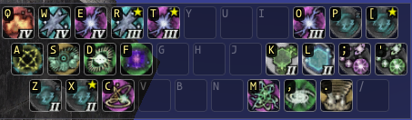
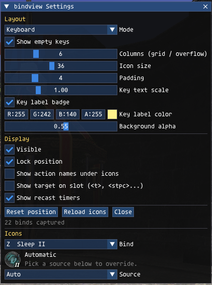

# bindview

A read-only keybind overlay for [Ashita v4](https://ashitaxi.com/). It shows the
`/bind` keybinds you already have as a grid of action icons laid out like a
keyboard, with the key drawn on each slot and recast timers on cooldown.

It never sets, blocks, or executes a bind. Your keybinds keep living wherever
they live today, for example in a LuAshitacast job profile.



## How it works

Every command in Ashita, including the ones other addons queue, passes through
a command pipeline that addons can observe. bindview watches for `/bind` and
`/unbind`, records the key and the command text, and lets them continue
untouched. Because of that it only sees binds issued after it loaded, so it
must be loaded before whatever sets your binds.

## Install

1. Copy the `bindview` folder into `Game/addons`.
2. In `Game/scripts/default.txt`, add the load line **before** luashitacast:

   ```
   /addon load bindview
   /addon load luashitacast
   ```

3. To pick it up without restarting:

   ```
   /addon load bindview
   /addon reload luashitacast
   ```

## Commands

| Command | Effect |
|---|---|
| `/bindview` | Toggle the overlay |
| `/bindview config` | Open the settings window |
| `/bindview show` / `hide` | Show or hide the overlay |
| `/bindview lock` / `unlock` | Lock or unlock the overlay position |
| `/bindview list` | Print captured binds to chat |
| `/bindview clear` | Forget every captured bind |
| `/bindview reset` | Reset settings to defaults |

Bind the toggle to a key from your profile if you want it on demand:

```
/bind ^b /bindview toggle
```

## Settings window



- **Mode**: Keyboard places each slot where its key sits on a US QWERTY board,
  one board per modifier layer (plain, Shift, Ctrl, Alt), cropped to the keys
  in use. Grid is a plain wrapped list in bind order.
- **Layout**: columns, icon size, padding, key text scale, badge, key color,
  background alpha.
- **Display**: visibility, lock, action names under icons, target hints,
  recast timers, empty keys.
- **Icons**: pick any bind and choose its icon from a list of spells,
  abilities, items, or generic icons. Automatic is the default and can be
  restored per bind.

## What resolves automatically

| Bind command | Icon | Timer |
|---|---|---|
| `/ma "Cure IV" <me>` | spell icon | spell recast |
| `/ja Sentinel <me>` | ability icon | ability recast |
| `/pet "Punch" <t>` | ability icon | blood pact timer |
| `/item "Poison Potion" <me>` | game item bitmap | none |
| `/ws "..." <t>` | generic weaponskill icon | none |
| anything else (aliases, macros) | generic command icon | none |

Shorthand names work: `protect2`, `protect 2`, `cureiv`, and `utsusemi1` all
resolve to the proper game name.

## Credits

Spell and ability icons in `resources/` are from
[tHotBar](https://github.com/ThornyFFXI/tHotBar) by Thorny, MIT licensed.
